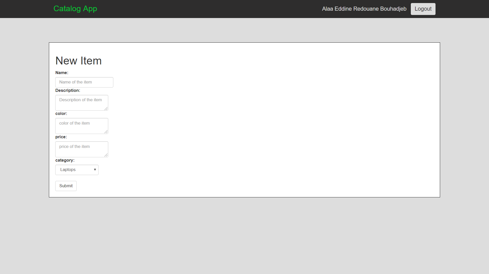

# Catalog App

**Catalog App** is a **Flask** web application that provides a list of items within a variety of categories as well as provide a user registration and authentication system. Registered users will have the ability to post, edit and delete their own items.

# Supported Python versions

The application is compatible with both Python 2 and 3 (3.5.2) but it's recommended to use **Python 3**

# Installing the Vagrant VM

**Note: If you already have a vagrant machine installed skip to the 'Fetch the Source Code and VM Configuration' section**

A virtual machine (VM) is needed to run the web server and the web app that uses it. The VM is a Linux system that runs on top of your own machine.  You can share files easily between your computer and the VM.

We're using the Vagrant software to configure and manage the VM. Here are the tools you'll need to install to get it running:

### Git

If you don't already have Git installed, [download Git from git-scm.com.](http://git-scm.com/downloads) Install the version for your operating system.

On Windows, Git will provide you with a Unix-style terminal and shell (Git Bash).  
(On Mac or Linux systems you can use the regular terminal program.)

You will need Git to install the configuration for the VM. If you'd like to learn more about Git, take a look at [Git](https://git-scm.com/docs) and [Github](https://guides.github.com/) doucumentation.

### VirtualBox

VirtualBox is the software that actually runs the VM. [You can download it from virtualbox.org, here.](https://www.virtualbox.org/wiki/Downloads)  Install the *platform package* for your operating system.  You do not need the extension pack or the SDK. You do not need to launch VirtualBox after installing it.

### Vagrant

Vagrant is the software that configures the VM and lets you share files between your host computer and the VM's filesystem.  [You can download it from vagrantup.com.](https://www.vagrantup.com/downloads) Install the version for your operating system.

**Windows Note:** The Installer may ask you to grant network permissions to Vagrant or make a firewall exception. Be sure to allow this.

## Fetch the Source Code and VM Configuration

Use your favorite terminal program, if you have **Windows** it's better to use Git Bash program (installed with Git) to get a Unix-style terminal.  

Then run:

    https://github.com/alaared1/fullstack-nanodegree-vm catalog-app

This will give you a directory named **catalog-app** with a **vagrant** folder inside complete with the source code for the flask application, a vagrantfile file for installing all of the necessary tools.

## Run the virtual machine!

Using the terminal, change directory to catalog-app (**cd catalog-app**), then to **vagrant** (**cd vagrant**) and type **vagrant up** to launch your virtual machine.

## Running the Catalog App
Once it is up and running, type **vagrant ssh**. This will log your terminal into the virtual machine, and you'll get a Linux shell prompt. When you want to log out, type **exit** at the shell prompt.  To turn the virtual machine off (without deleting anything), type **vagrant halt**. If you do this, you'll need to run **vagrant up** again before you can log into it.

Now that you have Vagrant up and running type **vagrant ssh** to log into your VM.  change to the /vagrant directory by typing **cd /vagrant** This will take you to the shared folder between your virtual machine and host machine, then go to the **catalog** folder (**cd catalog**).

Type **ls** to ensure that you are inside the directory that contains application.py, database.py, and two directories named 'templates' and 'static'

Type **python3 database.py** to initialize the database.

Type **python3 run-categories.py** to populate the database with categories.

Type **python3 run-queries.py** to populate the database with some items. (Optional)

Type **python3 application.py** or simply **./application.py** to run the Flask web server. In your browser visit **http://localhost:5000** to view the catalog app. You should be able to authenticate with google sign in, view, add, edit, and delete items.

This is what the home page looks like, on the left side there is a list of **categories**, and on the right side a list of **latest items** added, in addition to menu bar with 2 buttons one to **login** and the other **Catalog App** to go back to home page:

To view items of each category, select a category on the left list (ex: Desktop PC's)

To view item content, select an item on the right list (ex: APPLE iMAC)

In order to login click on the **Login** button and sign in with google:

After the login is successful you'll be redirected to the home page, you'll notice your **Username** near the **Login** button and **Add items** button that shows up in the catalog list:

Click on **add items** button to add an item:

After the item is sucessfully added you'll be redirected to the home, and you'll see the new item on the top of the **latest items** list:

Click on the added item to see the content, you can edit or delete the item now:

# More Information

For more information contact me on [alaa.bouhadjeb@gmail.com](mailto:alaa.bouhadjeb@gmail.com)
